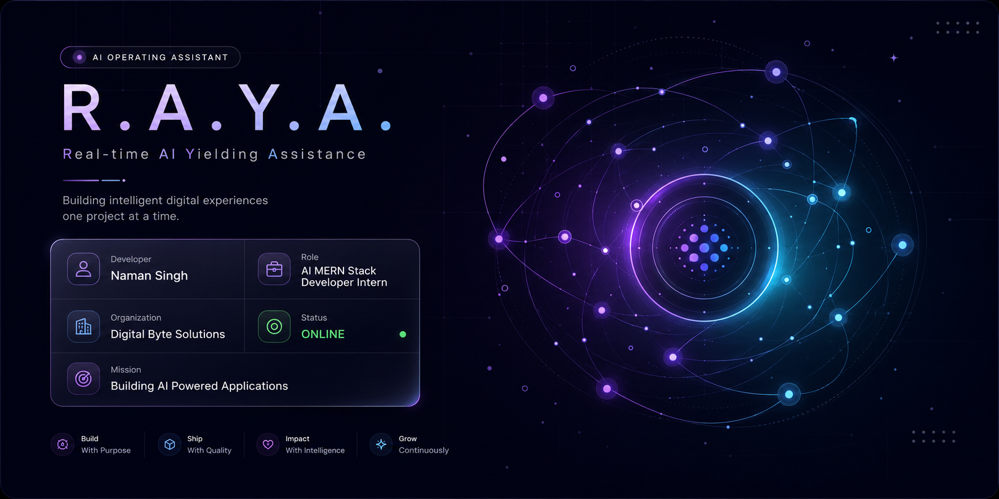
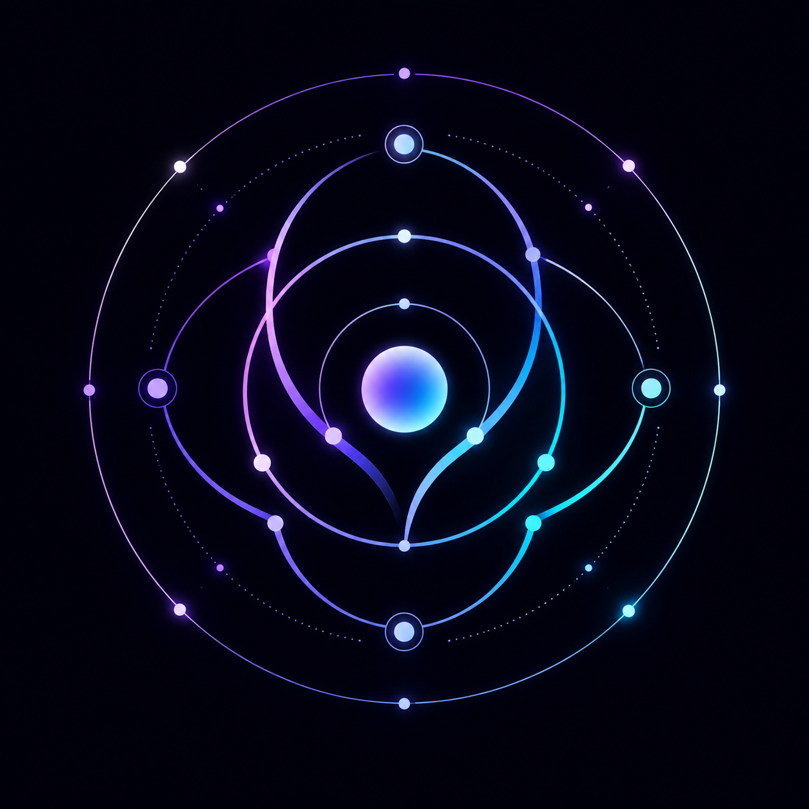
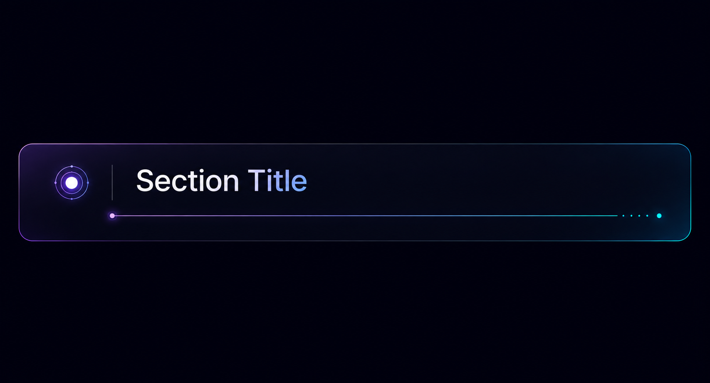
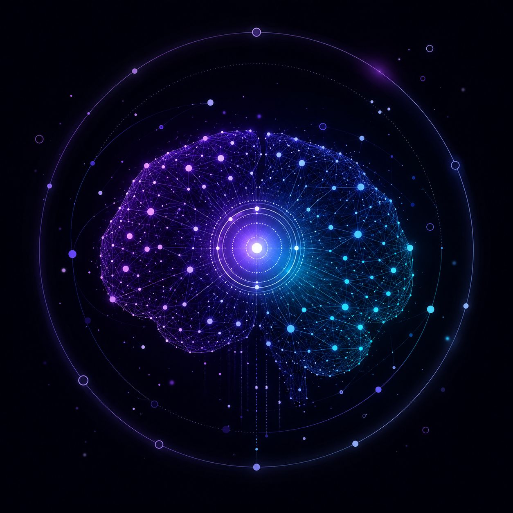
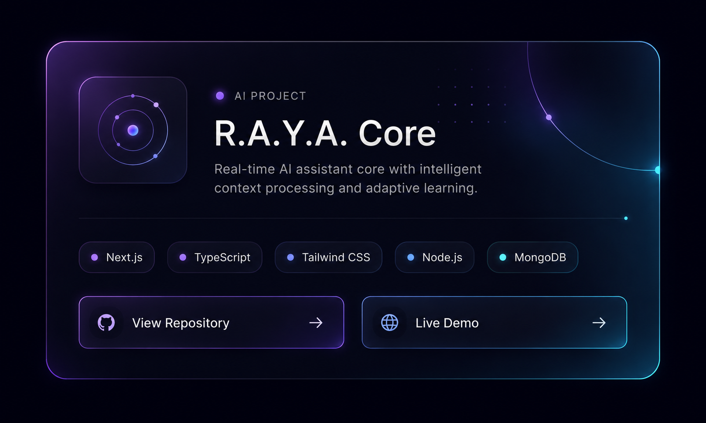
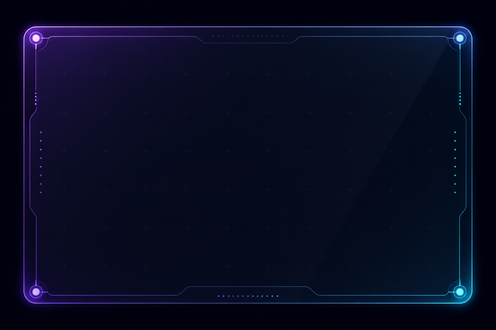
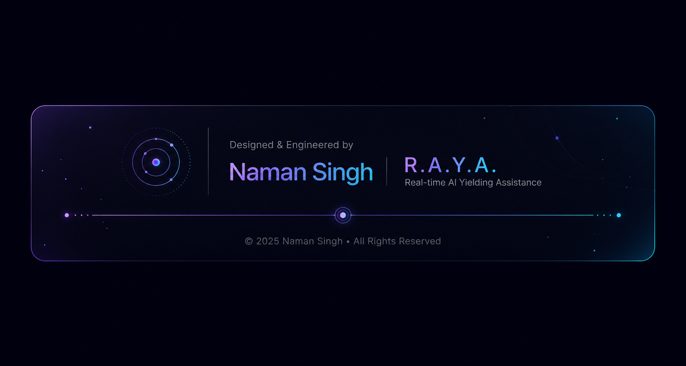

 

# Naman Singh

### AI-Focused MERN Stack Developer

 

 

## About Me

I'm an AI MERN Stack Developer Intern at **Digital Byte Solutions**, building full-stack web applications with an increasing focus on AI-integrated systems. My background spans Android development and UI/UX design before moving into full-stack engineering and applied AI — I care about writing production-quality code and designing experiences that are genuinely easy to use.

I'm currently deepening my skills in **agentic AI, Retrieval-Augmented Generation (RAG), and system design**, with the goal of building software that combines technical rigor with real usability.

- 🔭 Currently building AI-powered web applications on the MERN stack
- 🌱 Currently learning Agentic AI, RAG, System Design, and Docker
- 💬 Ask me about React, Node.js, MERN architecture, or applied LLM integration
- 📫 Reach me at **naman.2024it1142@kiet.edu**

## Snapshot

## Tech Stack

<table align="center">
<tr>
<td valign="top" width="33%">

**Languages**

</td>
<td valign="top" width="33%">

**Frameworks & Backend**

</td>
<td valign="top" width="33%">

**Databases**

</td>
</tr>
</table>

**Applied AI**

`Prompt Engineering` · `LLM Integration` · `OpenAI API` · `Gemini API` · `Mistral AI` · `Agentic AI (Learning)` · `RAG (Learning)`

**Design & Tooling**

 

## Experience

<table align="center" width="100%">
<tr>
<td width="15%" align="center"><b>Current</b></td>
<td width="85%">

**AI MERN Stack Developer Intern** — Digital Byte Solutions · India

Building AI-integrated web applications on the MERN stack in a collaborative team environment.

- Developing full-stack MERN applications end to end
- Integrating REST APIs and third-party services
- Designing responsive, accessible user interfaces
- Applying prompt engineering and LLM integration in production features
- Working within Git/GitHub-based team workflows

</td>
</tr>
</table>

## Education

**Bachelor of Technology — Information Technology**

Focus areas: Software Engineering, Artificial Intelligence, Web Development, UI/UX Design.

## Featured Project

 

## Other Projects

<table align="center" width="100%">
<tr>
<td width="50%" valign="top">

### 🎓 Student Attendance System
Full-stack attendance management platform with authentication, database integration, and a responsive UI.

`React` `Node.js` `Express` `MongoDB`

</td>
<td width="50%" valign="top">

### 📱 Android Development
Android applications built with a focus on clean architecture and Material Design.

`Java` `Firebase` `XML`

</td>
</tr>
<tr>
<td width="50%" valign="top">

### 🎨 UI / UX Design
Digital product design work spanning research, wireframing, and high-fidelity prototyping.

`Figma` `Adobe XD` `Canva`

</td>
<td width="50%" valign="top">

### 🤖 Applied AI Experiments
Small-scale projects exploring prompt engineering, LLM integration, and automation workflows.

`Python` `OpenAI` `Gemini` `Mistral`

</td>
</tr>
</table>

## Currently Learning

## GitHub Analytics

 

  

  

## Let's Connect

I'm always open to conversations about full-stack development, applied AI, or new opportunities. Feel free to reach out.

 

[⬆ Back to top](#naman-singh)

